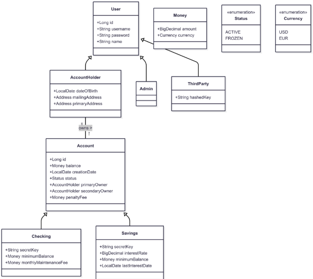
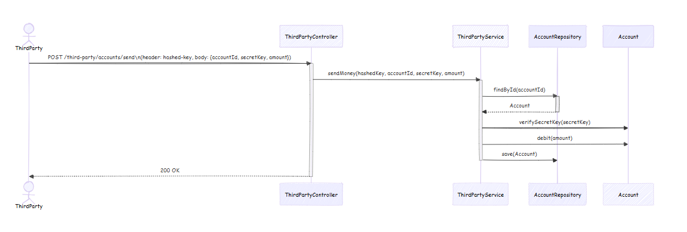
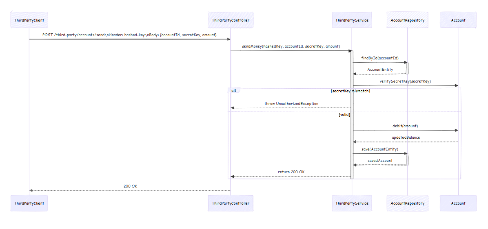
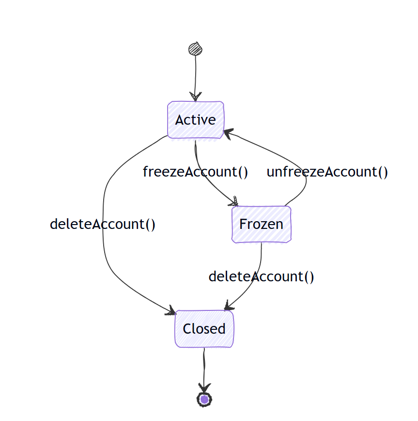
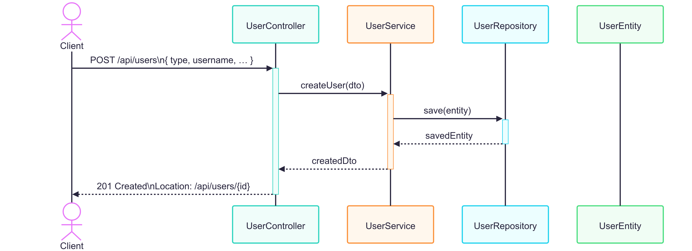
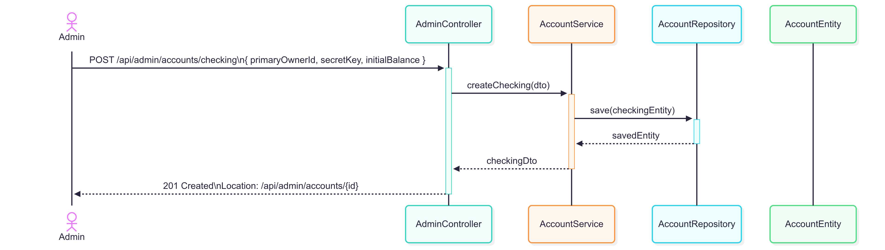
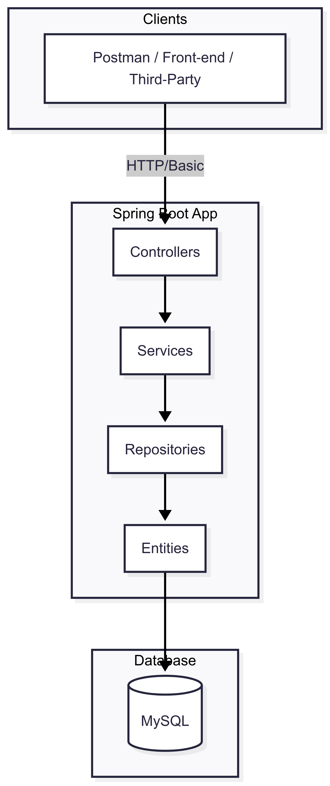
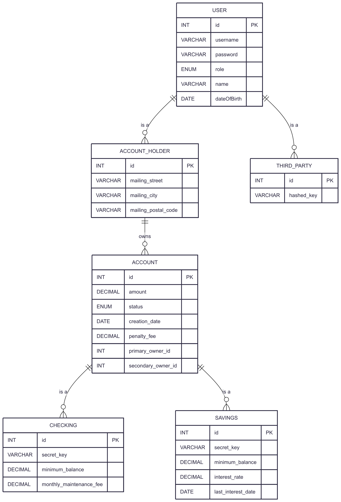

# Bank Back-End Service

This project implements the backend logic for a secure **banking system**, managing user accounts and third-party money transfers.

---

## Table of Contents

1. [Overview](#overview)
2. [Features](#features)
3. [Architecture](#architecture)
4. [UML Diagrams](#uml-diagrams)

   * [Sequence Diagram: Money Transfer](#sequence-diagram-money-transfer)
   * [Sequence Diagram with Exception Handling](#sequence-diagram-with-exception-handling)
   * [State Diagram: Account Lifecycle](#state-diagram-account-lifecycle)
   * [Class Diagram](#class-diagram)
   * [Use Case Diagram](#use-case-diagram)
5. [Setup and Configuration](#setup-and-configuration)
6. [Running the Application](#running-the-application)
7. [Testing](#testing)
8. [API Testing with Postman](#API Testing with Postman)
9. [Presentation](#presentation)
8. [Contributing](#contributing)
9. [License](#license)
10. [Author](#author)

---

## Overview

This back-end service allows:

* Creating and deleting bank accounts.
* Checking account balances.
* Performing debit and credit operations.
* Integrating with external clients (`ThirdParty`) to send and receive funds.
* Managing account states (`ACTIVE`, `FROZEN`, `CLOSED`).

## Features

* **Security**: Verifies `secretKey` for all third-party transactions.
* **Domain Modeling**: Entities such as `Account`, `AccountHolder`, `ThirdParty`, etc.
* **State Management**: Well-defined account lifecycle transitions.
* **Layered Design**: Separation of concerns across Controller, Service, and Repository.

## Architecture

The code follows a standard layered architecture:

1. **Controller**: Exposes REST endpoints (e.g., `/third-party/accounts/send`).
2. **Service**: Contains business logic (validation and transaction handling).
3. **Repository**: Interfaces with the database.
4. **Domain/Entity**: Defines the core data models.

## UML Diagrams

To visualize the system, refer to the UML diagrams under the `diagrams/` folder:

### Figure 1: Use‑Case Diagram


### Figure 2: Class Diagram


### Figure 3: Sequence Diagram – Send Money


### Figure 4: Sequence Diagram – Send Money With Exception


### Figure 5: State Diagram


### Figure 6: User Creation Sequence 


### Figure 7: Account Creation Sequence


### Figure 8: Deployment / Component Diagram 


### Figure 9: Entity–Relationship Diagram 


## Setup and Configuration

1. **Clone the repository**:

   ```bash
   git clone https://your-repository-url.git
   cd bank-back-lluc
   ```

2. **Environment variables**:

   ```env
   SPRING_DATASOURCE_URL=jdbc:postgresql://localhost:5432/bank_db
   SPRING_DATASOURCE_USERNAME=db_user
   SPRING_DATASOURCE_PASSWORD=db_pass
   SPRING_JPA_HIBERNATE_DDL_AUTO=update
   ```

3. **Build the project** (using Maven):

   ```bash
   mvn clean install
   ```

## Running the Application

Start the service with:

```bash
mvn spring-boot:run
```

**Key Endpoints**:

* `POST /third-party/accounts/send` – Transfer funds after validating `hashedKey` and `secretKey`.
* `GET /accounts/{id}/balance` – Retrieve account balance.
* `POST /admin/accounts` – Create a new account.
* `DELETE /admin/accounts/{id}` – Delete an account.

## Testing

* **Unit tests**:

  ```bash
  mvn test
  ```
* **Integration tests**:

  Configure a test database (e.g., PostgreSQL via Docker) and run:

  ```bash
  mvn verify
  ```

## API Testing with Postman

To explore and verify all endpoints interactively, import our Postman collection and environment:

1. **Import the Collection**
    - In Postman click **File → Import**, choose the **Link** tab and paste:
      ```
      https://.postman.co/workspace/My-Workspace~8427f1b1-b877-476c-8d49-8ade06a44b1d/collection/19714765-9ce82a7d-abaf-4a96-8abb-c08dc2ce187a?action=share&creator=19714765
      ```  
    - Click **Continue → Import**.
   

2. **Import the Environment**
    - In Postman click the **Environments** dropdown (top right) → **Manage Environments → Import** → paste the same link (it will detect the environment).
    - Or manually add a new environment named `BankBack` with these variables:

   | Key           | Initial Value                                             |
      | ------------- | --------------------------------------------------------- |
   | `baseUrl`     | `http://localhost:8080`                                   |
   | `adminUser`   | `admin`                                                   |
   | `adminPass`   | `admin123`                                                |
   | `holderUser`  | `alice`                                                   |
   | `holderPass`  | `alice123`                                                |
   | `thirdpUser`  | `thirdp`                                                  |
   | `thirdpPass`  | `tp123`                                                   |
   | `validHashKey`| `a1b2c3d4-e5f6-4712-89ab-cdef01234567`                     |

3. **Activate the Environment**
    - Select **BankBack** from the environment dropdown.


4. **Run the Requests**
    - Open any request folder (e.g. **User Management**, **Admin Operations**, **AccountHolder Operations**, **Third-Party Operations**, **Error Scenarios**).
    - Click **Send** or use the **Collection Runner**.
    - Postman will substitute `{{baseUrl}}`, `{{adminUser}}`, `{{adminPass}}`, etc., and handle Basic Auth automatically.

---

> **Tip:** Use Postman’s **Collection Runner** to automate your end‑to‑end tests in CI.

## Presentation

The slide deck for this project is available here:

[📊 Download Presentation](docs/Bank%20Back%20-%20Lluc.pptx)

## Contributing

1. Fork the repository.
2. Create a new branch:

   ```bash
   git checkout -b feature/your-feature
   ```
3. Commit your changes:

   ```bash
   git commit -m "Add feature X"
   ```
4. Push and open a Pull Request.

## License

This project is licensed under the MIT License. See the `LICENSE` file for details.

## Author

**Lluc Mata**

Feel free to reach out with questions or feedback!
